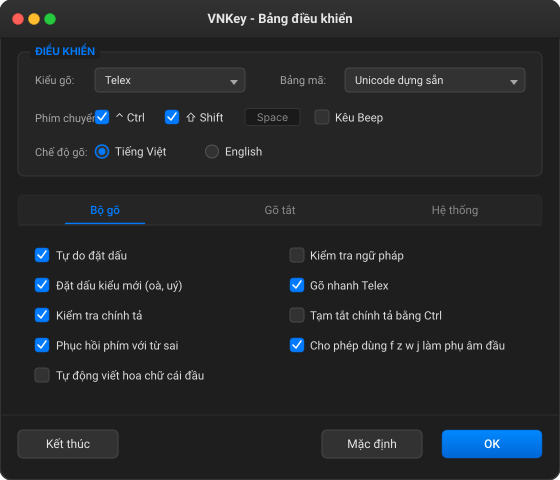

# VNKey 🇻🇳

[](https://developer.apple.com/macos/)
[](https://swift.org/)
[](https://developer.apple.com/xcode/)
[](LICENSE)

**VNKey** là bộ gõ tiếng Việt nguồn mở, nhẹ nhàng và hiện đại dành cho hệ điều hành macOS (được thiết kế với kiến trúc mô-đun sẵn sàng mở rộng cho cả Windows). Ứng dụng tập trung vào hiệu năng gõ phím mượt mà, **khắc phục triệt để lỗi gõ văn bản trên Google Docs** (lỗi nhảy con trỏ, lặp chữ, mất dấu — đây là điểm khác biệt và cải tiến vượt trội so với OpenKey), đồng thời loại bỏ hoàn toàn lỗi gạch chân (underline) và lỗi autocorrect trên các trình duyệt cũng như Excel.

Dự án được truyền cảm hứng và phát triển dựa trên nền tảng ý tưởng từ [OpenKey](https://github.com/tuyenvm/OpenKey) của tác giả Nguyễn Vĩ Tuyến, với mục tiêu nâng cấp khả năng tương thích hoàn hảo trên các nền tảng web hiện đại.

---

## 📸 Giao diện bảng điều khiển

Dưới đây là giao diện bảng điều khiển chính thức của VNKey (mô phỏng theo ngôn ngữ thiết kế macOS Dark Mode):



---

## ⌨️ Hỗ trợ kiểu gõ

VNKey hỗ trợ đầy đủ các kiểu gõ tiếng Việt thông dụng nhất hiện nay:

- **Telex**
- **VNI**
- **Simple Telex**

## 🔠 Bảng mã thông dụng

Hỗ trợ chuyển đổi linh hoạt giữa các bảng mã ký tự tiếng Việt phổ biến:

- **Unicode** (Unicode dựng sẵn - tiêu chuẩn)
- **Unicode Compound** (Unicode tổ hợp)
- **TCVN3 (ABC)**
- **VNI Windows**
- **Vietnamese Locale CP 1258**

---

## 🌟 Các tính năng nổi bật

### 1. Bộ gõ tối ưu

- **Tự do đặt dấu:** Cho phép bỏ dấu tự do ở bất kỳ vị trí nào của từ.
- **Đặt dấu kiểu mới:** Đặt dấu theo chuẩn chính tả mới (ví dụ: `oà`, `uý` thay vì `òa`, `úy`).
- **Kiểm tra chính tả & ngữ pháp:** Phát hiện và tự động sửa các lỗi từ gõ sai quy chuẩn tiếng Việt.
- **Phục hồi phím với từ sai:** Tự động khôi phục các phím đã gõ khi phát hiện từ không hợp lệ.
- **Tự động viết hoa:** Tự viết hoa chữ cái đầu tiên của câu hoặc sau dấu chấm.
- **Cho phép phụ âm đầu đặc biệt:** Cho phép sử dụng các phím `f`, `z`, `w`, `j` làm phụ âm đầu cho các từ mượn nước ngoài.

### 2. Gõ tắt & Macros nâng cao

- **Bảng gõ tắt tùy biến:** Quản lý và sử dụng danh sách từ gõ tắt cá nhân.
- **Tự động viết hoa phím tắt:** Tự động nhận diện viết hoa theo từ phím tắt gốc.
- **Gõ nhanh phụ âm đầu/cuối:**
  - Phần đầu: `f` -> `ph`, `j` -> `gi`, `w` -> `qu`.
  - Phần cuối: `g` -> `ng`, `h` -> `nh`, `k` -> `ch`.
  - Lặp từ nhanh: `cc` -> `ch`, `gg` -> `gi`, `kk` -> `kh`, `nn` -> `ng`...
- **Gõ tắt ở chế độ tiếng Anh:** Cho phép sử dụng macros gõ tắt ngay cả khi đã tạm tắt chế độ gõ tiếng Việt.

### 3. Tương thích hệ thống sâu & Trình duyệt

- **Sửa triệt để lỗi gõ trên Google Docs (Điểm khác biệt cốt lõi so với OpenKey):** Xử lý hoàn hảo cơ chế kết xuất văn bản của Google Docs (Canvas/DOM) — giải quyết dứt điểm tình trạng bị mất chữ, nhảy vị trí con trỏ hoặc lặp từ thường gặp trên OpenKey và các bộ gõ truyền thống.
- **Sửa lỗi gạch chân trên macOS:** Loại bỏ hoàn toàn vạch gạch chân màu xanh khó chịu khi gõ của bộ gõ mặc định.
- **Sửa lỗi Autocorrect trình duyệt:** Không còn hiện tượng bị trùng ký tự, nuốt từ trên Chrome, Safari, Firefox, hay Microsoft Excel.
- **Chuyển chế độ thông minh:** Tự động loại trừ và tắt gõ tiếng Việt khi vào các ứng dụng đặc thù (code editor, terminal...).
- **Gửi từng phím (Send Key Step):** Chế độ dự phòng giả lập bàn phím vật lý đối với các ứng dụng có cơ chế bảo mật hoặc nhận diện phím nghiêm ngặt.
- **Khởi động cùng hệ thống:** Thiết lập tự động khởi chạy cùng macOS để sẵn sàng sử dụng.

---

## 🚀 Cách cài đặt

### Cách 1: Cài đặt nhanh qua Terminal (Khuyên dùng)

Bạn có thể tải, giải nén và kích hoạt VNKey trực tiếp chỉ bằng các dòng lệnh Terminal dưới đây:

```bash
# 1. Tạo thư mục Input Methods trong thư mục Library của người dùng (nếu chưa có)
mkdir -p ~/Library/Input\ Methods

# 2. Tải bản release mới nhất của VNKey về thư mục Downloads
curl -L -o ~/Downloads/VNKey.zip https://github.com/nguyenmanhphuc/VNKey/releases/latest/download/VNKey.zip

# 3. Giải nén file zip trực tiếp vào thư mục Input Methods
unzip -o ~/Downloads/VNKey.zip -d ~/Library/Input\ Methods/

# 4. Kích hoạt và mở bộ gõ lần đầu tiên
open ~/Library/Input\ Methods/VNKey.app
```

---

### Cách 2: Cài đặt thủ công

1.  Truy cập vào mục **Releases** của repository này trên trình duyệt và tải file `VNKey.zip` bản mới nhất.
2.  Nhấp đúp chuột để giải nén file tải về, bạn sẽ nhận được ứng dụng `VNKey.app`.
3.  Mở Finder, nhấn tổ hợp phím `Cmd + Shift + G` và dán đường dẫn: `~/Library/Input Methods`.
4.  Kéo thả hoặc sao chép `VNKey.app` vào thư mục vừa mở.
5.  Nhấp đúp vào `VNKey.app` để khởi chạy ứng dụng.

---

### Cách 3: Biên dịch từ mã nguồn (Dành cho Lập trình viên)

Dự án sử dụng **XcodeGen** để quản lý cấu hình dự án Xcode. Bạn có thể tự build ứng dụng thông qua Terminal:

```bash
# 1. Cài đặt công cụ XcodeGen (nếu máy của bạn chưa có)
brew install xcodegen

# 2. Di chuyển vào thư mục dự án và khởi tạo file xcodeproj từ project.yml
xcodegen generate

# 3. Biên dịch ứng dụng VNKey với chế độ Release
xcodebuild -project VNKey.xcodeproj -scheme VNKey -configuration Release -derivedDataPath build_output build

# 4. Cài đặt file build vào thư mục hệ thống
mkdir -p ~/Library/Input\ Methods
cp -R build_output/Build/Products/Release/VNKey.app ~/Library/Input\ Methods/

# 5. Khởi động ứng dụng
open ~/Library/Input\ Methods/VNKey.app
```

---

## ⚙️ Kích hoạt bộ gõ trên macOS

Sau khi cài đặt ứng dụng vào thư mục `Input Methods` và chạy ứng dụng:

1.  Vào **Cài đặt hệ thống (System Settings)** > **Bàn phím (Keyboard)**.
2.  Tại phần **Nguồn nhập (Input Sources)**, chọn nút **Sửa... (Edit...)**.
3.  Nhấn nút dấu **+** ở góc dưới bên trái, tìm kiếm từ khóa `VNKey` trong danh sách tiếng Việt.
4.  Chọn **VNKey** rồi nhấn **Thêm (Add)**.
5.  Chọn biểu tượng VNKey trên thanh Menu Bar ở góc trên cùng bên phải màn hình để bắt đầu thiết lập kiểu gõ và các tùy chọn.

---

## ⚠️ Lưu ý quan trọng (Notes)

> [!WARNING]
> **Tránh xung đột bộ gõ:** Bạn **bắt buộc phải tắt hẳn** hoặc gỡ bỏ các bộ gõ tiếng Việt khác đang chạy ngầm trên hệ thống (chẳng hạn như EVKey, OpenKey, GoTiengViet) để tránh hiện tượng xung đột phím, gõ bị lặp từ hoặc mất dấu.

> [!IMPORTANT]
> **Cấp quyền Trợ năng (Accessibility Permission):**
> VNKey cần quyền Trợ năng của macOS để có thể đọc các sự kiện bàn phím vật lý nhằm xử lý và thay thế văn bản tiếng Việt.
>
> - Lần đầu chạy, ứng dụng sẽ yêu cầu quyền này.
> - Nếu ứng dụng không tự động yêu cầu hoặc gõ không ra tiếng Việt, hãy truy cập:
>   `Cài đặt hệ thống > Quyền riêng tư & Bảo mật > Trợ năng` (System Settings > Privacy & Security > Accessibility).
> - Tìm ứng dụng `VNKey` trong danh sách và bật công tắc cho phép.

---

## 👥 Tác giả & Giấy phép

- **Ý tưởng và Thiết kế gốc:** Lấy ý tưởng từ dự án bộ gõ mã nguồn mở [OpenKey](https://github.com/tuyenvm/OpenKey) của tác giả **Nguyễn Vĩ Tuyến**.
- **Phát triển bởi:** [Nguyễn Mạnh Phúc](https://github.com/Biggiezz).
- **Bản quyền & Giấy phép:** Dự án được phát hành công khai dưới giấy phép mã nguồn mở **GPL v3**. Bạn hoàn toàn được phép sao chép, tùy chỉnh và phát triển tiếp nối miễn là tuân thủ các điều khoản nguồn mở của giấy phép này.
